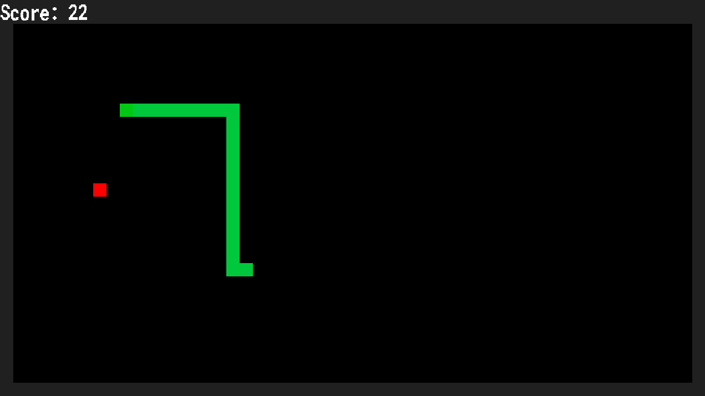

# Snek!
A simple game made in C!
Feed the snek and move it into food to make it bigger!

[Live Demo Here at my Website! Click here to play right in the browser!](https://ashtheamin.github.io/snek/snek.html)

# Instructions
Movement: Use WASD or arrow keys to move the snek
Start: Hit E to set difficulty to easy, R to regular, and Q to hard.
Gameplay: Hit P to pause
End: Hit any key to go back to start.

# Dependencies:
- This program depends on `gcc` to compile it to native Linux or other OS code. Though any other C compiler should work.
- This program depends on the C standard library.
- This program depends on `roboto mono` to render the text
- This program depends on `libsdl2` to render the graphics and handle input/output
- This program depends on `emscripten` to compile it to a webassembly target

# Compiling:
Initial steps
- Have a directory with the snek.c file in it
- Create a folder called third_party/roboto_mono/
- Add the roboto mono font and name it RobotoMono-Bold.ttf

Natively on Linux:
- Assuming you have Debian Linux: Ensure `gcc`, `libsdl2-dev` and `libsdl2-ttf-dev` are installed.
- Ensure you are in the directory containing the C file
- Run`gcc -o snek snek.c -lSDL2 -lSDL_ttf -Wall -Werror`
- Run the output with `./snek` in the directory to execute.

Compiling for WebAssembly:
- Assuming you are on Debian Linux, ensure that emscripten latest toolchain is installed.
- Ensure you are in the directory containing the C file
- Run `em++ snek.c -o snek.html -s USE_SDL=2 -s USE_SDL_TTF=2`
- The `snek.js`, `snek.html` and `snek.wasm` output files can be used then to host the output on the Web.

# Program architecture:

# Code execution lifecycle
- The program enters the `main()` function.
- The `snek_init()` is run initialises all data structures as they should be to start the game and allocates data to heap.
- The `snek_loop()` loop is run appropriately based on the target platform.
- The program state is initialised to `START_MENU`, which scans for inputs.
- The user has the option to adjust difficulty, or else the program is then on any other keypress, shifted to the `MID_GAME` status.
- A snek entity is what the player must guide to the food entity. The program every x milliseconds, based on difficulty, will update entities and render the map.
- Input is polled, `snek_input()` is called to process it to set the snek direction then `snek_update()` and `snek_render()` are called every x millisecondds to update the entities and world.
- Score is increased every time food is consumed, and the snek entity is not allowed to bump into itself or the walls.
- If the snek entity does something that is forbidden, then the program will be set to the GAME_OVER status and will show the game over screen.
- If a key is presased, then reset the state to `START_MENU` and restart the cycle.
- If the program state is set to `QUIT_LOOP`, then the loop is broken and all resources freed and de allocated.

# Data structures and variables:
Constants:
- These are set to represent important information that functions depend on.
- These include screen resolution, colours for tile maps, program states, difficulties and directions.

Snek struct:
  - A global variable stored on the stack which points to a pointer to allocated memory on the heap.
  - The pointer points to locations which functions rely on to retrieve information.
  - This includes SDL window, renderer, font, program status, snek entity, food entity, and the map and direction and timer.

Snek entity struct:
  - A linked list abstract data type that stores all nodes associated with a snek entity.

Food entity:
  - Two ints that represent a coordinate for the food entity.
 
Status:
  - The current state of the program.
 
Direction:
 - The direction the snek's head is assumed to go on the next update, based on the current input.
 
Timer:
  - This stores the information needed to keep track of when it is appropriate to call the update function.

Tile Map:
  - An integer 2D array matrix that stores informations for tiles to render.
  - This is the method in which entities can be represented and displayed on the screen
  - `snek_render()` will update this map based on the colours represented in each position on the grid.
